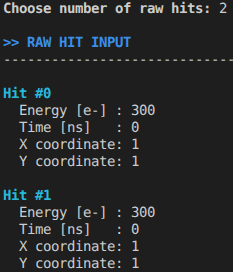

[[_TOC_]]

# MALTA_SIMULATION
The MALTA2 sensor is the second full scale implementation of the MALTA sensor family. An accurate simulation of the sensor performance in a test beam environment is desired for both test beam data validation but also future sensor redesign work. One such activity is the use of a MALTA-like sensor for digital calorimetry applications.

## Description
This repository contains a pure GEANT4 simulation of a DMAPS sensor, MALTA2. An accurate charge collection and charge sharing model is implemented via a parametrization of the charge collection model gained via digital scans of MALTA2 Epi samples in the SPS test beam. These measurements have been separately checked with an Edge Transient Current Technique (E-TCT) measurements. Compatible depletion depth measurements have been gained via both measurements.

The project is built with the help of a Cmake file: CMakeLists.txt. The simulation is divided into several directories described below: 

- /analysis. Directory contains all the C++ ROOT scripts for data processing, reconstruction and analysis
- /build. Directory contains all the built files via CMake
- /configs. Directory contains all the configuration files used in the simulation and analysis.
- /include. GEANT4 header files
- /macros. GEANT4 run and vis macros. They are called via config flags
- /plotting_scripts. Directory contains all plotting scripts which can be used to quickly generate plots
- /run_files. Directory contains all run files needed to run both locally and on the cloud. Includes CONDOR job submission templating
- /src. GEANT4 source files

# Local Installation

```bash
# Clone Repository
git clone https://gitlab.cern.ch/dberlea/malta_simulation.git
cd malta_simulation
# Setup environment
source setup.sh
# Create the build directory
mkdir build 
cd build
# Build the project
cmake $CMAKE_ARGS ..
make
```

# Quick usage

## GEANT4 Usage
```bash
cd build/
source ../run_sim.sh local flag.cfg
```
## Basic Analysis Usage
```bash
cd malta_simulation/
python run_analysis.py -r runNumber -i analysis_flags.cfg -thr thrValue -s saveName -d -t -c -a 
```

Flag Utilization guide:
| Flag   | Utility |
|--------|-----|
| -d  | MALTA2 Digital Processing |
| -f  | MALTA3 Digital Processing |
| -fHWC  | MALTA3 HWC Digital Processing|
| -t  | Tracking |
| -c  | Clustering |
| -a  | Analysis |
| -C  | Calorimetry analysis | 


## Basic MultiPlane Analysis Usage
```bash
cd malta_simulation/
python run_analysis_multiPlane.py -r runNumber -i analysis_flags.cfg -thr thrValue -s saveName -d -t -c -a 
```

All the analysis flags are the same as in the case of the single plane analysis, however the scripts used are in another folder analysis_multiPlane. This analysis can be used for single plane analysis, however this requires the use of a MutiPlane config inherited geometry in the GEANT4 simulation. As a consequence, legacy simulation folders should still be ran with the single plane analysis equivalent. 


## Basic Multiplane config Usage

A large scale detector can be implemented with the help of a .csv file found in /configs/geometry/. The user is instructed to use the example_geo.csv file as an example and build their own geometry. The file defines multiple MALTA2 detectors that can be arranged in different positions and angles relative to the GEANT4 origin.

File layout:

| Entry | Meaning|
|-------|--------|
|x[#]   | X Module ID (0-99)|
|y[#]   | Y Module ID (0-99)|
|z[#]   | Z Module ID (0-99)|
|xoff[cm]| x offset|
|yoff[cm]| y offset|
|zoff[cm]| z offset|
|xrot[deg]| x rotation|
|yrot[deg]| y rotation|
|zrot[deg]| z rotation|
|mod[#]  | Module ID|

Illegal positioning of MALTA2 detectors will be flagged by the GEANT4 checkOverlap function. 

In order to use the desired geometry file the correct path needs to be passed in both the simulation and analysis flags files.

## Basic Config files

Several sample simulation and analysis config files have beer prepared for the user. 

GEANT4 simulation config files:

    -flags_SP.cfg simple single plane MALTA simulation
    -flags_SP_ITK.cfg MALTA single plane simulation with an ITK hit occupancy based particle gun
    -flags_SP_Calo.cfg MALTA single plane simulation of calorimetry. A single thick tungsten plate is considered
    -flags_MP.cfg MALTA multi plane simulation
    -flags_MP_Calo.cfg Large scale calorimeter detector simulation

Analysis config files. In this case several modifications may need to be implemented to make them comaptible to the various GEANT4 simulation flags. 
    -analysis_flags_SP.cfg MALTA single plane analysis. Should work out of the box with the flags_SP.cfg simulation flag
    -analysis_flags_MP.cfg MALTA multi plane analysis. Should work out of the box with the flags_MP.cfg simulation flag

# Analysis examples

## MALTA2Digitizer

Usage: ./build/malta2Digitizer 

Example of the MALTA2 digitizer (-d). A default threshold value of 200 e- is used. The config file used is hardcoded and points towards configs/analysis_flags_SP.cfg. The script requires sample hits to be provided at the run time of the script. In order to visualize the coordinate dependent merging, the energy and time needs to be kept the same between all hits. Due to the simulated analog jitter, the user time setting is not deterministic. A way to bypass this TBD. 




# GEANT4 Simulation structure
The GEANT4 simulation is structured based on the usual file format. The functionality of each class is described further below:

## ActionInitialization
This class inherit the GEANT4 class G4VUserActionInitialization. It is used to initialize all the actions at the different GEANT4 levels in the package. The following actions are currently defined in the package: PrimaryGenerator, RunAction, EventAction, SteppingAction, TrackingAction. All initializations are done at the thread level, except for the run action which is additionally defined at the master thread level.

## Config
This class implements all the methods for importing and saving configurations and also creating run directories and handling path managements

    - DumpConfigToFile() copies the used flag file to the run directory
    - CreateNextRunDirectory() creates the next run directory based on the last value of the incremented local or naf directory structure
    - LoadSimFlagFromFile() loads all the simulation configuration flags
    - GetRequestCpusFromSubmitFile() Used for checking the number of requested CPUs is comaptible with the number of GEANT4 threads for remote job submission
    - trowWarning() Formatted warning trowing
    - trowError() Formatted error trowing
Detailed explanation of the simulation flag functionality is described in another subsection below.

## CorrectionData2D
The current simulation code does not use this function.
CorrectionData2D.cc is the input file of a 2D in-pixel efficiency map. This is useful if instead of the analytical efficiency parameterization, a direct data input is preferred. nBinsX and nBinsY defines the number of bins and spacingX, spacingY the distance between bins in microns. The data can incorporate asymmetries or a more detailed structure than the simple analytical function.

## Create2DEffMap
This function is used to generate CorrectionData2D.cc based on a TH2D "histName" in a specified root input file.

## DetectorConstruction
This class inherits the GEANT4 class G4VUserDetectorConstruction. It is used to define the solid, logic and physical volumes associated to the elements of the simulation. The aim of this class is to create an accurate simulation of the real MALTA2 sensor and fixtures but at the same time keep the geometry of the active detector simple enough in order to keep the computation times low.

### World Volume
The world volume is simulated as vacuum, defined with the help of the pre-defined nist G4_Galactic. This is in order to limit the particle interactions outside of the sensitive volume and further optimize the computation time. The world volume is designed as a G4Box of size 2 *m x 2 *m x 2 *m, centered at the origin. Any further geometry implementation needs to respect the following X, Y, Z boundaries: [-100 *m, 100 *cm]. This boundary check is enforced via a FATAL ERROR handling.

### Sensor Volume
The sensor volume is simulated as a monolithic Silicon block using the pre-defined nist G4_Si. Concerning the sensitive material, this simulation does not take into account the following elements:

- the non-sensitive SiO2 layer on top of the Si bulk
- the Cu metal layers above the PMD 
- the metal for the transistor gates of the N, P -MOSFETs
- the dopants and geometry of surface or deep implants
- any Si wafer post-processing procedure e.g. back metallization, conductive glue, etc.

The solid volume is defined as a G4Box with customizable values. Default values are implemented in the sample configs/flags.cfg file.

Currently 7 MALTA planes are implemted where the z positions were taken from the .toml MALTA analysis files with the following planeID naming:
    - DUT (center) planeID 0
    - first 3 tracking planes planeID 1-3
    - last 3 tracking planes planeID 4 -6

### PCB Volume
The Printed Circuit Board (PCB) to which the MALTA samples are glued to is simulated. Currently, the PCB implementation is implemented separately to the sensor simulation, allowing a switch between the 2 via a flag. A unitary implementation might be desired in the future, however the PCB stack is subject to change between different iterations.

The PCB is implemented as Copper and dielectric planes with the help of the edms files of the E-TCT PCB. Two materials are used in the simulation. The pre-defined nist G4_Cu and a custom defined material: FR4. The FR4 material is defined as a mixture of O, C, Si, H, Na, B. The component percentage of each element was computed taking into account the atomic formula of a typical fire retardant PCB material found at reference: https://www.physics.smu.edu/web/research/preprints/SMU-HEP-08-11.pdf and the molar mass of each element. All Copper and FR4 planes are defined as rectangular 12.7 x 12.7 cm^2 but with various thicknesses as defined in the design file. (TODO: The current geometrical implementation does not match the exact physical dimensions of the board. For a more accurate implementation, define custom volume and not a G4Box). All Copper planes have the same thickness of 18 microns. Three FR4 thickness planes are defined depending on their position in the stack: Outer plane (20 microns), Middle plane (100 microns), Inner plane (200 microns). All planes are arranged side by side with no gaps between them. 

## EventAction
This class inherits the GEANT4 class G4UserEventAction and provides the control over GEANT4 processes at the event level. Currently, the implementation allows for handling actions at the beginning and end of an event via 2 methods: PhMattEventAction::BeginOfEventAction(const G4Event* event), PhMattEventAction::EndOfEventAction(const G4Event* event)

### EndofEvent Action
Progress bar is implemented in order to output the expected total simulation time and elapsed time. The elapsed time is updated in a pre-defined step size, relative to the total number of events: totalEvents / 100. The progress bar print out is performed in a thread-safe manner with the help of the G4AutoLock lock(&g4CounterMutex) object. 

## PhysicsList
This class inherits the GEANT4 class G4VModularPhysicsList and defines the physics to be considered in the simulation. Two physics cases are envisioned for the simulation package:

1. The energy deposition of hadrons in thin Silicon layers is accurately simulated by G4EmStandardPhysics(). 
2. The hadron interaction in several planes of a telescope require further considerations for other effects, such as hadronic interactions. Preliminary physics list for hadron interactions: G4DecayPhysics; G4HadronElasticPhysics; G4HadronPhysicsFTFP_BERT; G4StoppingPhysics; G4IonPhysics. 

Currently, physics lists are switched with the help of flags.

The SetCuts() method is implemented to modify the production cuts of e-, e+ and gammas. This has an impact on secondary particle propagation in thin sensors, such is the case of the MALTA2 sensor. A very low production cut has an impact on the size of the stored data, however it improves accuracy in simulating secondar propagation. A value of 1 um was found to yield reasonable results for the tracking of a single MALTA2 sensor.

## PrimaryGenerator
This class inherits the GEANT4 class G4VUserPrimaryGeneratorAction and defines the particle generator. All particles are generated via the G4ParticleGun(1) method. This defines the number of primaries (1) that GEANT4 will shoot at the generator level of the class. The number of primaries that GEANT4 shoots at the same time can however be customized with the help of the particleCount flag which is implemented at the GeneratePrimaries level in order to account for random sampling of desired parameters: position, momentum, energy, particle type.

Currently, continuous distributions of the primary position is implemented via the following functions:

1. Pencil beam: define a fixed position in PhMattPrimaryGenerator() as a G4ThreeVector
2. Circular beam: defined with the GetRandomPointOnCircle() method in GeneratePrimaries()
3. Rectangular beam: defined with GetRandomPointOnRectangle() method in GeneratePrimaries()

Currently, no energy distribution, beam straggling, beam spread or mixed particle type is implemented. 

The time structure of the beam can be customized with the help of the beamVeto flag.

Additionally, a specific time structure of the particle gun can be implemented via the itkEnable flag. It aims to simulate the particle hit occupancy in the ATLAS detector, scaled to the size of the MALTA sensor. The simulation can switch between several layers and/or regions of the ATLAS detector via the flags: itkInput, itkLayer. The data input files are in the /ITK_Input directory. The ATLAS hit occupancy simulates a luminosity <mu> = 200. This factor can be scaled with the help of the pileUpScale flag. Additionally, the pseudorapidity region can be selected with the help of a flag.

## RunAction
This class inherits the GEANT4 class G4UserRunAction and gives access to run level GEANT4 actions.

In the class constructor the following Ntuples are defined:

1. "RawPixelHits" Ntuple ID 1 is populated in SensitiveDetector::ProcessHits. It has the following columns:
    - "iEvent" stores the Event ID from G4RunManager::GetRunManager()->GetCurrentEvent()->GetEventID()
    - "iPlane" stores the Plane ID
        Example:
        if(planeName == "physSensor") 
        {
            planeID = 0;
        }
    - "PixX" stores the X coordinate of the hit from: pixelCluster[i][0]
    - "PiXY" stores the Y coordinate of the hit from: pixelCluster[i][1]
    - "hitTime" stores the global timing from: preStepPoint->GetGlobalTime()
    - "hitEnergy" stores the energy deposit of the GEANT4 hit defined from: GetEfficiencyAnalytical(InPixPos)* energy*100000/3.66
    Ntuple used for storing the raw Silicon hits

2. "TruthVertex" Ntuple ID 2 is populated in PrimaryGenerator::GeneratePrimaries. It has the following columns:
    - "iEvent" stores the Event ID from oneEvent->GetEventID()
    - "trueVertexX" store X coordinate of the primary vertex from G4ThreeVector(x, y, z)
    - "trueVertexY" store Y coordinate of the primary vertex from G4ThreeVector(x, y, z)
    - "trueVertexZ" store Z coordinate of the primary vertex from G4ThreeVector(x, y, z)
    - "trueGlobalTime" stores the global time stamp derived from the event ID via evtID * fFlag->beamVeto *ns + offSet *ns

The class additionally handles the IO calls for opening and closing the output root files in the BeginofAction() and EndofAction() methods respectively.

## SensitiveDetector
This class inherits the GEANT4 G4VSensitiveDetector class and allows GEANT4 actions limited to volumes defined as sensitive in `DetectorConstruction::ConstructSDandField()`.


### Charge collection efficiency
Each energy deposit is scaled by a charge collection efficiency that depends on the in-pixel location. The energy deposit is distributed among the seed and its 3 nearest neighboring pixels (the three neighbors of the nearest pixel corner). The analytical scaling is derived from testbeam data and based on error-functions: `SensitiveDetector::GetEfficiencyAnalytical()`.

### Timing
The `SensitiveDetector::GetTimingOffset()` method calculates the timewalk based on amplitude and threshold. The parameterization was measured at a threshold of 150e-. Consequently, this threshold is used for reference. The timewalk for other thresholds is obtained by scaling the x-axis (charge-axis) accordingly. This is based on the assumption that the waveform of an n-times larger signal is the same at an n-times larger threshold. In data this is only valid if the front-end gain is changed through a different bias current. The same assumption can be phrased as: The gain scales with 1/threshold. This scaling is chosen because at the same gain setting (fixed front-end) only a limited threshold range can be covered. For example at "normal" gain a range of 200-700 e- can be covered. Larger threshold ranges can only be reached by lowering the gain. The threshold scaling is illustrated in [plotting_scripts/plot_timewalk_curves.py](plotting_scripts/plot_timewalk_curves.py)

## SteppingAction
This class inherits the GEANT4 G4UserSteppingAction class and implements GEANT4 actions at the step level.

## SubmissionTests
Implementation of tests to run before Condor Job submission. 

## TrackingAction
This class inherits the GEANT4 G4UserTrackingAction class and implements GEANT4 actions at the track level. Currently, has no implementation. Can be used in the future to kill early unwanted tracks for increasing computation efficiency.

# Analysis chain. analysis/
This directory provides all the tools for performing the tracking, clustering and analysis of the raw simulation files. All functions are written as root functions. At each analysis step a debugging/monitoring root file is created in the Results/ directory together with monitoring histograms in the Plots/ directory. 

## DigitalProcessing
Provides the MALTA2 digital processing of the hits. The main steps of this analysis step are:
1. Summ up all hits based on eventID and hit pixel coordinates. The code was revised. While the suming logic is inherited in the code, the main suming step is performed in GEANT in order to reduce the data size.
2. Create threshold dispersion map
3. Apply threshold to all 4 or more hits associated to 1 event and discard all hits below threshold
4. Compute the timing of the hit based on 3 effects: global time stamp, timeWalk calculated with GetTimingOffset() and rowPropagation calculated via 7ns/ 512 rows. Additionally, a multi-chip time offset of 8 ns is added when running in multiPlane mode.
5. Encode the hits into digital words, following the MALTA bit description
6. Sort all digital words into time buckets of programmable size
7. Merge all words inside the same time bucket, applying a simple OR operation to them
8. Decode all hits inside a word and encode this value in NHits

The digital processing outputs the following data:

    Results/SaveName/PlaneIDReconstructedHitsThrvalue.root/ReconstructedHits: 
       PixX
       PixY
       Timing
       NHits
    Plots/SaveName/histos.root/h1Dthreshold - 1D dsitribution of the threshold smearing
    Plots/SaveName/histos.root/h2Dthreshold - 2D dsitribution of the threshold smearing

## PRIOFIFOFullDigitalProcessing
Provides the MALTA3 digital processing of the hits. Just as in the case of the DigitalProcessing script, a minimal readout simulation is implemented, which aims only to recreate the mechanisms of digital word loss due to merging and pile-up. The main of steps of this analysis track are:

1. Group level hit merging. Two or more hits will be merged in the same MALTA word if they fall into the same group in a time window defined by the user defined variable: slowcontrolDelay. Dominik Danheim's PhD thesis quotes a possible range between 0.5 - 2 ns in the current slow control DAC implementation. The merging of hits into a single word can be either beneficial or desturctive. Due to the hot encoding of the pixel address, each pixel position has a reserved position in the 16 bit word. If two hits in the same group position arrive, one of the hits will be lost. If two hits arrive in different positions, the merging will be constructive. Statistically, this effect is much more likely to be a constructive effect. A value smaller than 0.5 ns is not probable to be implemented, however a larger value could be accomodated into the design.

Parameters: slowcontrolDelay

2. Bus level merging. The MALTA matrix is divided into 512 buses that transmit the pixel data column-wise towards the periphery. Each double -collumn (DC) contains 2 busses. Neighboring pixel groups in a DC are divided into even or odd pixel groups and occupy a sepparate bus. Each read-out bus contains 21 lines (16 pixel address + 5 group ID). Every time a pixel group generated a VALID digital signal (given by the 16-OR logic of REF pulses in a group), a 21 bit word is propagated down the repsective column bus. The bus propagation is characterized by a characteristic time measured in the test beam: 7ns/512 rows. This equates to a row by row word propagation of 0.012 ns /row. The column propagation is facilitated by NAND gates and buffer circuits. If a bus is occupied by the word propagation at a specific row and another word gets pushed into the bus, the two words will be merged in the NAND gate. Due to the 0 bit propagation of the hot encoded pixel hits, this acts as an effective OR between the two words. This will most likely lead to an un-physical shift of hit coordinates or even loss of hit information. The merging threshold is defined by the default value of: 0.105. For most applications, this loss mechanism does not have a leading order effect. 

Parameters: busMergingThreshold

3. Synchronization Memory pile-up. Each column bus is drained into a memory circuit. The memory is divided into (default values) 2 width, 4 depth SRAM blocks. In order to cope with the word size (21b of position information + 17b of timing information) 19 SRAM blocks are implemented for each bus. The memory is further clocked by a maximum clock of 640 MHz frequency and drained into a FIFO. The memory draining is done one memory block per clock cycle. Due to the many to one connection between all the memory blocks of the entire array and the single FIFO, a priority algorithm needs to be implemented. The default priority encoder algorithm is Round Robin. An loss of information can occur at this stage if a memory block is full (by default 4 words) and another word arrives, without a reading clock cycle occuring (due to the hit timing). 

Parameters: SRAMFrequency, SRAMDepth

4. FIFO pile-up. The entire sensor contains a 128 word (64b each) width FIFO. The maximum read-out of this FIFO is defined by the maximum LpGBT read-out bandwidth of 10.4 Gb/s. This translates to a maximum word frequency of 160 MHz. Several FIFOs can be multiplexed still into a single read-out line. A maximum multiplexing of 6-7 FIFOs to one read-out line is possible. The multiplexing effectively increases the size of the FIFO but reduces proportionally the bandwith/ readout frequency per FIFO. The only mechanism through which the read-out frequency of a single FIFO can be increased could be the existance of several read-out lines off-chip. 

Parameters: FIFOFrequency, FIFOSize

## PRIOFIFOHWCProcessing
Performs the digital processing of Raw MALTA hits. The design is based on a modified MALTA3 readout. It contains an additional circuit per readout bus in the chip periphery: Haming Weight Circuit (HWC). The design modification aims to improve the calorimetry counting performance at the detriment of position resolution. The readout aims to provide only X or Y strip information with a maximum resolution on the order of one double column.

Steps 1, 2 and 4 inherited from hte PRIOFIFOFullDigitalProcessing script. Only the step 3 contains significant changes. All words arriving at the end of the column are treated in the following maner:

The 21 bits corresponding to the pixel and group end of column information are condensed into a 4 bit word. This word contains only the number of high bits in the pixel address, effectively encoding the number of hits in a triggered group. The 4 bit word is stored into 2 SRAMS of dimensions: width 2 and depth 4. In order to form 64 bit words for the FIFO processing step, several words are read out in the same read cycle. For the simple case of 1 4 bit word per column a maximum of 14 words can fit in a single 64 output word. An additional 6bit of information is appended which encodes the sector ID for future position reconstruction. Additionally, 2 chip ID bits are reserved for future implementation. Assuming an ordered read-out from all SRAMs the readout order of the 4 bit sub-words determines the double column position. Futher word multiplexing can be performed by itteratively adding together neighboring multiplexed words. E.g. 4b + 4b = 5b word. This allows for further hit information condensation. In the case of 5bit words, a maximum of 11 double collumns can be encoded into a single 64 bit word. This multiplexing can be further extrapolated up to a bit size of 11 bits which can enode the number of hits in the entire matrix, at the cost of total loss of position resolution. In the simulation, the implementation can be customized by requesting both the desired sector size (which encodes the number of double collumn contained into a single 64 word) and the word size which needs to be set according to the limitation of the 64b AURORA word. User guideline for value choices is detailed below:

|sectorSize | wordSize |
|-----------|----------|
|     7     |    4     |
|    11     |    5     |
|    18     |    6     |
|    32     |    7     |
|    56     |    8     |
|    96     |    9     |
|   160     |   10     |
|   256     |   11     |

## Tracking
Performs the matching between tracks reconstructed from MONTE CARLO truth information and reconstructed hits given spatial and timing cuts
1. Time sort all the tracks, based on the MONTE CARLO truth information provided by GEANT4. 
2. Perform a rolling window look-up between DUT hits and tracks in a programmable time window and match time adjacent hits to tracks
3. Perform a distance cut between each hit and the track based on a programmable distance cut
4. Save all the valid hits and give any invalids sentinel values (-1)

The tracking outputs the following data:

    Results/SaveName/LocalTrackedHitsThrValue.root/TrackedHits:
       trackID
       reconstructedVertexX
       reconstructedVertexY
       reconstructedGolbalTime
       PixX
       PixY
       nHits
       reconstructedLocalTime
    Plots/SaveName/histos.root/h2DUTHits - Hits reconstructed but not yet tracked on the DUT
    Plots/SaveName/histos.root/h1ResidualX - X tracking residual distribution
    Plots/SaveName/histos.root/h1ResidualY - Y tracking residual distribution

## Clustering
Provides the clustering of hits that were found to be time and space adjacent to a track in the previous tracking processing
1. The -1 sentinel values are identified as non-efficient hits
2. Cluster candidates are formed from valid coordinates
3. A cluster filtering algorithm is applied to check for valid clusters. Valid cluster criterion: Only spatially adjacent hits can form a cluster. Diagonally adjacent hits are cut from the final cluster formation.

The clustering outputs the following data:

    Results/SaveName/analysisThrValue.root/analyzedHits:
       analysisVertexX
       analysisVertexY
       clSize
       timing

4. The cluster position can be saved via two methods, controlled by the clPos flag. If the flag is set as MC, then the Monte Carlo position of the hit assigned to the cluster is saved. If the flag is set as COM, the center of mass of the cluster is saved.

## Analysis
Provides the final analysis step which computes the per bin efficiency, cluster size and timing. 

The analysis outputs the following files:

    Plots/SaveName/histos.root/h2PASS - 2D sensor efficiency
    Plots/SaveName/histos.root/h2ClSize - 2D sensor Cluster Size
    Plots/SaveName/histos.root/h2Timing - 2D sensor Timing
    Plots/SaveName/histos.root/h2PASSInPixel - 2D 2x2 in pixel projection efficiency
    Plots/SaveName/histos.root/h2ClSizeInPixel - 2D 2x2 in pixel projection cluster size
    Plots/SaveName/histos.root/h2TimingInPixel - 2D 2x2 in pixel projection timing
    Plots/SaveName/histos.root/h2PASSInPixel - debugging histogram. passed hits 2x2 in pixel projection
    Plots/SaveName/histos.root/h2ALLInPixel - debugging histogram. all hits 2x2 in pixel projection

Summary data of average efficiency, cluster size, timing, threshold is saved in the following nTuple:

    Plots/SaveName/summary.root/sumarryTree:
       threshold
       efficiency
       effError
       clSize
       clSizeError
       timing

## SimulationToProteus
Optional/ Alternative analysis path. Formats the 7 plane data (1 DUT + 6 tracking planes) to the usual Proteus MALTA format. This allows for analysing the simulated data with the help of the standard test beam framework.

## MALTAClustering 
Alternative clustering algorithm designed to mimic the MALTA TB algorithm. In this case, the clustering of time adjacent hits is performed first. The same cluster filtering is performed like in the case of the Clustering.cc

## MALTATracking
Alternative tracking algorithm designed to mimic the MALTA TB analysis. In this case, the tracking is performed on the reconstructed clusters. A cluster is matched to a track as long as any of the in-cluster hits are within a distance cut to it.

# Plotting scripts. plotting_scripts/

## compare_data_sim
A simple python script that reads in data-points as well as simulation output. The simulation output is that of simpleAnalysis.c.
A list of root-simulation output files can be specified in `sim_inputs` together with a plot label and some marker and line styles.

## plot_timewalk_curves
This illustrates the timewalk scaling as discussed above. The measured timewalk at a threshold of 150e- is scaled to other threshold values by x-axis (charge axis) multiplication.

## ratio_data_sim
This is to quantify the agreement or mismatch between two TH2Ds. It reads in histograms from data and simulation and calculates their ratio bin-by-bin. There is a check for the same bin numbers in x and y. The resulting TH2D is saved as pdf.

## ROOTTHelperFunctions
A list of useful functions for pyroot which is only used in compare_data_sim.py.

## simpleAnalysis
Root macro that takes as input the thread-wise root output files. The analysis assumes the Geant4 events as independent and performs a tracking and timing cut of the MALTA hits relative to the MCtrue primary vertex. (TODO: Currently the path is hardcoded. Find smarter way of passing the path)

## summary_plots
Root macro that takes as input the average tracking figures of merit from summary.root files generated by the analysis chain in order to create comparison and/or data trend plots.

Currently the data input is manually passed  via the following variables:
std::vector<int> runNumbers= {} - the run number denoted by different GEANT4 simulation run number
std::vector<std::string> runFiles = {} - the analysis name denoted by different analysis chain of the same simulation run
Additionally th labels variable passes the desired plotting labels
std::vector<std::string> labels = {} - legend labels should have the size of runNubers.size() * runFiles.size()

The plots are just displayed but not saved. Manually saving required. If no X server is available for remote operation, a change go pdf saving of the canvases can be implemented.

## visualize_TCT_data
Root macro that takes as input E-TCT data as analog waveforms. Outputs pixel charge collection distributions.

# Config files. configs/
The user is encouraged to create their own configuration file as desired. The simulation (e.g. flags.cfg) and analysis (e.g. analysis_flags.cfg) flags can be easily passed via the argument line. If a foreign local installation of the package is desired, additional path configuration might be needed. The default ALMA9 path configuration is implemented via config.sh. Customized examples of local path sourcing can be seen in the config_vlad.sh and config_lucian.sh. A manual pointing towards the GEANT4, ROOT and any other non intialized libraries is needed for other local implementations. The passing of the correct config file is explained in the run_files section. 

## geometry file

Module/ large scale detector building from simple MALTA sensors can be done using the simulation flag preDefinedGeometry = MULTIMALTA. Additionally, a path to a .csv file needs to be provided in the geofile field. The geometry files reside in configs/geometry/. Each MALTA plane needs to be configured in terms of indices (x, y, z), offset from the origin (xoff, yoff, zoff) and rotation (xrot, yrot, zrot), additionally MALTA planes should be organized in terms of the module index (mod). Planes with the same modle index are digitized together, allowing for inter-chip merging. An example of 4 adjacent MALTA modules is given in example_geo.csv. The chosen file path for the simulation needs to also be imported in the analysis config file. Additionally, the analysis config needs to implement the accurate plane distribution via the nplanes_100 (# of planes in z), nplanes_10 (# of planes in y), nplanes_1 (# of planes in x) and modules (number of distinct modules) fields.

## analysis_flags

Time walk calibration scaling default values:

    -T = 390, Tdiv = 200, TrefThr = 150, x0 = 149.8, n = 0.65, t0 = 0

Time jitter of the MALTA2 read-out default values:
    -scintillatorJitter = 0.5, samplingJitter = 0.9

MALTA2 digital encoding information default values:

    -groupSize = 16, groupLeng = 5, parityLeng = 1, dColLeng = 8

MALTA2 merging time bucket size default value:

    -wordSpacing = 1.6

Number of thread-wise data files to analyze default value:

    -numThreads = 6

Charge loss scaling of the deposited charge default value:

    -chLoss = 1

Threshold smearing in the mean and column default values:

    -meanSmearing = 0.08, colSmearing = 0.02

Tracking and clustering distance and time cut default values:

    -distCut = 100, timeCut = 500

Tracking uncertainty enable/disable default value:

    -trkUnc = true

Cluster position information. Can be saved as either Monte Carlo Truth (MC) or the center of mass (COM)

    -clPos = MC/COM
    
Verbose flags for each analysis step default values:

    -verboseDigital = false, verboseTracking = false, verboseClustering = false, verboseAnalysis = false

X and Y Track offset. Correct values are needed in order to sucesfully align the sensor and the particle beam in the tracking stage. Default values for a detector off-set of 5 cm: (50 - 18.6368/2 = -40.6816):

    -trackOffsetX = -40.6816
    -trackOffsetX = -40.6816   

Beam veto value. It represents the fixed time between consecutive beam bunches from the GEANT4 particle gun. This value needs to match the value used in the GEANT4 simulation step. This flag is only used in the calorimetry analysis. Default value for calorimetry:

    -veto = 10000

MALTA3 readout parameters. The significance of these parameters is explained in a dedicated MALTA3 section above. Additionally, several flags are introduced in order to maintain the simulation compatibility with other tracks. The boolHWC flag should be used only in the case of the special Haming Weight Circuit simulation implementation. When turned on, it modifies the calorimetry hits per event computation compared to the usual calorimetry of the MALTA2 and MALTA3 FIFOProcessing scripts. The Sector Size and word size are flags native to the HWC analysis tracks. The Sector Size defines the number of double columns multiplexed into a single word, while the wordSize encodes the size of each multiplexed word. There is a strict relation between these 2 quantities: [sectorSize, wordSize] = [7,4],[11,5],[18,6],[32,7],[56,8],[96,9],[160,10],[256,11]. The prioAlgo represents the priority encoding algorithm used in the HWC track. Three different algorithms can be used: RoundRobin, MostFilled, MostFull.  Default values are:

    -slowcontrolDelay = 0.5
    -busMergingThreshold = 0.105
    -SRAMFrequency = 1.5
    -sramDepth = 4
    -FIFOFrequency = 6.25
    -FIFOSize = 128
    -boolHWC = true
    -sectorSize = 7
    -wordSize = 4
    -prioAlgo = RoundRobin / MOSTFULL / MOSTFILLED
    
Multi-plane simulation processing flag. It switches between two modes: MALTA2 and MALTA3. The only difference between the 2 is the module building of the two sensors. MALTA2 modules propagate hits in a daisy-chained form, leading to additional error sources. MALTA3 does not yet have a module strategy. In the simulation, it is assumed that no module-specific error sources exist.

    -simProc = MALTA2 / MALTA3

MultiPlane allignment files. These flags need to be correctly configured in the use case of the multiPlane geometry mode. This is the default use case for multiple Plane simulations. The nPlanes_100 flag encodes the number of planes in the z axis, nPlanes_10 in the y axis and nPlanes_1 in the x axis. The modules flag encodes the number of distinct modules. In the case of any MALTA3 analysis this should always be the same as the total number of planes. In the case of the MALTA2 planes, modules of up to size 4 can be built in the x axis. The input geometry file needs to reside in configs/geometry/. The path to the file is passed via the geoFile flag.

    -nPlanes_100 = 1
    -nPlanes_10 = 1
    -nPlanes_1 = 1
    -modules = 1
    -geoFile = geo_X1Y1Z1.csv

## flags.cfg

Geometry flag used for switching between the MALTA geometry implementation, the PCB geometry implementation and the MULTIMALTA scalable implementation. The geoFile flag imports the position and orientation of all sensitive MALTA sensors. The largeScaleFlag is an additional flag that allows for the implementation of passive material in conjuction with the MULTIMALTA multiple planes implementation.

    -preDefinedGeometryFlag = MALTA / MALTASPS / PCB / MULTIMALTA
    -largeScaleFlag = EPICAL
    -geoFile = geo_EPICAL.csv

Detector X,Y,Z offsets relative to the GEANT4 origin in [cm]. Default values:

    -detectorXOffset = 5., detectorYOffset = 5. ,detectorZOffset = 5.

Pixel size default value [mm]:

    -pixelSize = 0.0364 

Sensor dimension default values X, Y[cm], sensitive Depth [um]:

    -detectorSizeX = 1.86368, detectorSizeY = 1.86368, detectorDepth = 29.1

Charge sharing model parametrization in X and Y default values:

    -CCModelSigmaX = 4.3, CCModelSigmaY = 4.3   
    
World volume material. Accepted values are G4_GALACTIC (vacuum) and G4_AIR:

    -outsideMaterial = G4_Galactic / G4_AIR

Particle source geometry. Available presets: pencil, circle, rectangle, granularBeam = 1 particle every 2 pixels in X (simulate out of group hits). The gausSmearing flag works in conjunction with the gaussian beamGeometry and defines the X and Y symmetric sigma in cm.

    -beamGeometry = pencil / circle / rectangle / granularBeam / gaussian
    -gausSmearing = 0.1

Beam offset in X, Y, Z default values [cm]:

    -beamXOffset = 5., beamYOffset = 5., beamZOffset = - 100.

Beam size, assuming only symmetrical beam geometry implementation (sourceRadius flag) The circle beamGeometry uses this. Asymmetric implementation via the flags: soureRadiusX, sourceRadiusY. The rectangle geometry uses this. Default value [mm]:

    -sourceRadius = 18.6368, -sourceRadiusX = 18.6368, -sourceRadiusY = 18.6368

Spill size, or number of particles fired in a coincidence time window, default value:

    -particleCount = 1

Number of events in a GEANT4 run, default value:

    -numEvents = 100000

Intra spill offset that can simulate the delays introduced by cabling in real devices, default value:

    -intraSpillOffset = 0

Period of the beam, default value [ns]:

    -beamVeto = 1000

Primary particle type, default. Additionally a special implementation can be enabled with the flag: pionMix for an equal population of positive and negative pions.

    -particleType = proton

Primary particle energy, default value [GeV]. EnergyDistribution currently implemented is log:

    -particleEnergy = 120
    -energyDistribution = none

Momentum of the primary particle, default values:

    -particleMomentumX = 0., particleMomentumY = 0., particleMomentumZ = 1.

Primary generator ATLAS ITK Input. itkEnable flag enables or disables the ATLAS ITK particle population; pileUpScale sclaes up or down the luminosity content. The data is based of off <mu> = 200; the itkInput flag points towards the data input file residing in ITK_Input; the itkLayer flag selects the layer in the respective ITK subdetector; the itkZ flag selects the pseudorapidity region, based on the radial z coordinate.

    -itkEnable = false
    -pileUpScale = 1
    -itkInput = pixBarrel_occ
    -itkLayer = 0
    -itkZ = 0

Physics list flags. Enable/disable different physics processes, default values:

    -EMPhysics = true, hadronPhysics = true

Simple single plane calorimetry. Should be used together with MALTA preDefinedGeometryFlag. The implementation can be switched on or off via the flag dutTungstenAbsorberFlag. The thickness of the absorber can be set via the flag absorberThickness.

    -dutTungstenAbsorberFlag = false
    -absorberThickness = 3.2

Distance cut values for e-,e+ and photons, default value:

    -GEANT4CutValue = 1

Raw data storage path for local and naf running, default values:

    -outputPathLocal = Results, outputPathNAF = Results

GEANT4 macro files for local and naf running, default values (run - batch mode, vis - gui mode):

    -macroFileLocal = run.mac, macroFileNAF = run.mac

Number of Threads. Should match the number of usable cores. Optimization between physical/ virtual cores. Default values:

    -numThreadsLocal = 6, numThreadsNAF = 12

Verbose flags for different parts of the simulation, default values:

    -verbosePL = false, verbosePG = false, verboseSD = false, verboseSA = false

## config.sh
For expert users only. If a local GEANT4 installation is available and desired, the following path format should be replicated:

    -export LOCAL_PATH=/home/path/to/repo 
    -export LOCAL_GEANT=/home/path/to/geant4/geant4.sh 
    -export LOCAL_ROOT=/home/path/to/root/thisroot.sh 
    -export EXTRA_LOCAL=NEEDED_LIBRARY_HERE=/path/to/lib 
    -export NAF_GEANT=/cloud/path/to/geant/geant4.sh 
    -export NAF_PATH=cloud/path/to/repo
    -export NAF_USER=user

# Run macros. macros/
Three GEANT4 macros are implemented:

    - run.mac. The main batch mode run macro. Supresses all GEANT4 verbosity. Can be enable by setting the fields to 1
    - run_test.mac. The run macro for the dry runnin before a job submission.
    - vis.mac The visualization macro. Particle colour scheme or other visualization values possible.

# Run files. run_files/
Three shell scripts are implemented in this directory that schedule the running of the simulation package:

    - run_script_local.sh handles the running locally. 
    The term locally also applies for running a simulation on a remote machine as long as no job submission to a computer cluster is involved.
    
    - run_script_naf.sh handles the cluster computing job submission. 
    This assumes access to the naf computing infrastructure or any other compatible infrastructure. However, path compatibility needs to be resolved. WARNING! such a run mode only works with a Condor job submission format.
    
    - run_script_local_test.sh handles the running of a local dry run
     before the submission of a job to the cluster, in order to ensure correct compilation of the package before requesting computing resources.

Instructions for passing a customized config.sh file:

1. Ensure that the file has a custom naming scheme and is present in the /configs folder. 
2. Identify the local HOME directory path with the help of
    echo $HOME
3. Edit the run_script_local.sh file, following the format:

    elif [$HOME = "/Users/lucianfasselt"]; then
        echo "Running as user lucian"
        source ../configs/config_lucian.sh


## Visuals
TODO

# NAF Installation

```bash
# Log in to NAF
ssh username@naf-atlas.desy.de

# Create a working directory in your private area
mkdir -p private/directory_name
cd private/directory_name

# Initialize Git repository
git init
git remote set-url origin git@gitlab.cern.ch:7999/dberlea/malta_simulation.git
git pull origin master

# Create build and results directories
mkdir build Results condor_log
```